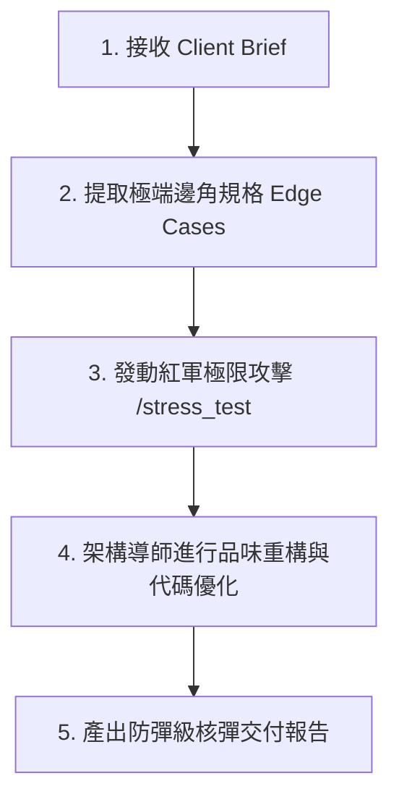

# Trench Accelerator 專屬服務方案：【總監轉型——30天代理架構極限實戰】

**客戶對象**：29 歲轉職工程師（深陷 CRUD 泥淖、面臨 AI 與實習生雙重淘汰焦慮，急需重獲技術掌控力與資深底氣）
**顧問團隊**：Trench Accelerator (COO 暨全體 AI Specialists 代理群)
**日期**：2026-06-17

---

## 🟥 核心診斷：夾縫中的生存危機

你目前的焦慮，並非來自你寫 code 的速度不夠快，而是因為**你正以「肉體與工時」和 AI 及實習生拼速度**：
1. **向上被 AI 降維打擊**：AI 能在一秒內生成百行 CRUD 代碼，如果你的價值只在於「貼代碼與改錯」，你將被迅速取代。
2. **向下被低成本實習生夾擊**：實習生用 Cursor 也能快速組裝出能動的畫面，你的「年資與經驗」在沒有架構品味的情況下顯得毫無防禦力。

**我們的核心信仰**：
> 「你可以外包你的思考過程（執行面），但你絕對不能外包你的理解力與品味。」
我們將協助你脫離「AI 打字員」，轉型為指揮 AI 代理群的 **「AI 總監：具備頂級架構審美與防禦力的監督者」**。

---

## 🟧 方案核心模組：4 大 Specialist 聯合防線

我們將 4 位 Specialists AI 代理植入你的工作環境，通過動態攻防與架構重塑，為你建立技術護城河：

### 1. 【工作流與權力審計】—— Specialist 1: Workflow Auditor
* **執行任務**：深度監控並審計你目前的開發行為。
* **交付價值**：揪出你每日工作流中低價值的「肉體勞動」（例如：手動對齊 UI、手寫重複的 SQL 查詢），強迫你將開發模式升級為「Agent 調度與規格定義」思維，把手動代碼率 (MCR) 降至 20% 以下。

### 2. 【代理群紅軍極限攻擊】—— Specialist 2: Red-Team Hacker
* **執行任務**：觸發核心指令 `/stress_test`。此職位「僅在 AI 在場時存在」—— 瞬時模擬 10 個頂尖 AI 代理，針對你的專案架構發動高強度的邏輯與底層滲透。
* **攻擊焦點**：
  * **併發控制 (Race Conditions)**：對 AI 產出的庫存/狀態變更邏輯發動高頻併發滲透。
  * **越權漏洞 (Broken Object Level Authorization)**：攻擊 AI 產出的扁平化 API 結構。
  * **極限邊界崩潰 (Edge Case Flooding)**：用異常的資料結構或極端輸入使系統崩潰。

### 3. 【總監級架構與品味重構】—— Specialist 3: Agentic Architect Mentor
* **執行任務**：守護系統架構的高防禦性，指導你設計極端邊角規格 (Edge Cases)。
* **架構重塑**：
  * 引入 **防禦性架構設計** (如 Service Layer 隔離區、Clean Architecture 簡化版)，將 AI 產出的「大便代碼」封鎖在特定邊界內，使其易於一鍵重構。
  * 培養你的「技術品味」，教你如何校準 AI 的產出以符合資深工程師的設計模式。

### 4. 【知識資產與 Prompt 診斷】—— Specialist 4: Prompt Diagnostician
* **執行任務**：診斷並優化你與 AI 協作時的 Context 結構，修正 Prompt 的角色與限制定義。
* **交付價值**：將本專案成功的調度經驗固化為你個人專屬的 Prompt 資產庫，讓你在未來的接案中能重複調用。

---

## 🟨 COO (營運長) 升級版工作流程

為了確保你拿到的是「防彈衣」而非靜態報告，我們將執行以下五步實戰工作流：

1. **接收 Brief**：確認你的專案架構（例如：React / Node.js 系統）。
2. **邊角規格提取**：強制要求你提供系統的「極端邊角規格 (Edge Cases Spec)」，不容許模糊地帶。
3. **發動紅軍攻擊**：COO 觸發 `/stress_test`，由 Red-Team Hacker 發動多維度攻擊，產出致命漏洞清單。
4. **品味重構**：將漏洞報告交給 Architect Mentor，為你設計防禦性代碼及重構方向。
5. **整合成報告**：最終交付包含攻防實測、代碼對比的核彈級手冊。

---

## 🟩 核彈級交付物結構 (Nuclear Deliverables)

我們為你準備的，是能向雇主、業主甚至未來的面試官證明你「不可替代性」的實戰手冊：

1. **【攻防弱點報告】**：紅軍攻擊的詳細紀錄與漏洞位置，證明你具備「看穿系統漏洞」的資深法眼。
2. **【邊角邏輯盲區排除手冊】**：針對高併發、權限越權等極端狀況的防禦性代碼設計，展示你對邊角邏輯的掌控力。
3. **【AI 臃腫代碼剔除對比 (Bloat-Cutter Diff)】**：
   * 展示將 150 行充滿重複 `try-catch` 的 AI 程式碼，精簡重構成 40 行優雅 Middleware 的對比。
   * **這 110 行的架構美學差異，就是你身為「總監」相對於「實習生/代碼工」的溢價證明。**
4. **【加值服務：活著的紅軍監控 Agent】**：交付一隻可在你本地運作的持續整合監控 Agent，在後續開發中持續陪跑，隨時進行代碼防禦性審查。

---

## 🟦 預期轉型 ROI 與價值轉化

* **手動代碼率 (MCR) 降至 20% 以下**：你將學會控兵，用 20% 的時間指揮 AI 實作，80% 的時間進行架構防禦與品味校準。
* **48小時完成原本一週的工作**：極速結案，省下的時間即是你的高毛利利潤。
* **底氣轉化**：從面臨被淘汰的恐懼，轉變為**「業主專案的數位防線總監」**。你賣的不再是代碼，而是高強度的資產安全保障。
